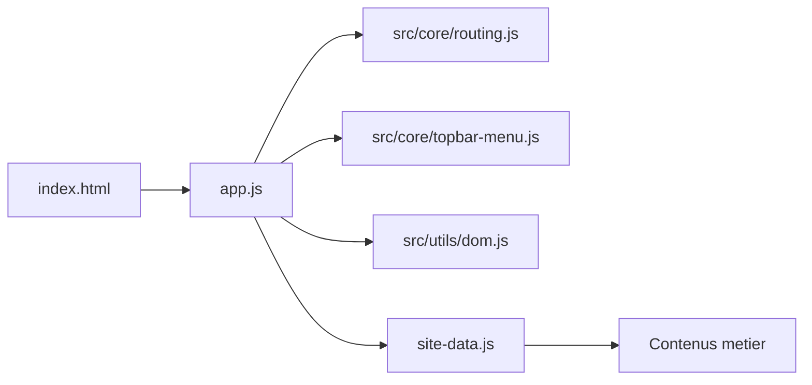

<p align="center">
  
</p>

<h1 align="center">ASA Prenois Bourgogne - Site officiel</h1>

<p align="center">
  Site vitrine statique (HTML/CSS/JS) pour l'ASA Prenois Bourgogne.
</p>

<p align="center">
  
  
  
  
</p>

<p align="center">
  
</p>

## Navigation rapide
- [Apercu](#apercu)
- [Objectifs](#objectifs)
- [Demarrage local](#demarrage-local)
- [Verification qualite rapide](#verification-qualite-rapide)
- [Deploiement Vercel](#deploiement-vercel)
- [Architecture](#architecture)
- [Structure du projet](#structure-du-projet)
- [Documentation](#documentation)

## Apercu
| Evenements | Actualites |
| --- | --- |
|  |  |

## Objectifs
- Afficher les parcours `calendrier`, `inscriptions`, `actualites`, `contacts` et `vie-asa`.
- Rester simple a deployer (aucun build obligatoire).
- Garder un code evolutif avec responsabilites claires et architecture modulaire.

## Demarrage local
1. Ouvrir un terminal dans `Site-circuit`.
2. Demarrer un serveur statique:
   - `python -m http.server 5500`
3. Ouvrir `http://localhost:5500`.

## Verification qualite rapide
Executer les controles automatiques avant push:

```powershell
node --check app.js
node --check src/core/routing.js
node tools/check-quality.cjs
```

## Deploiement Vercel
Le projet est un site statique sans build obligatoire. La configuration Vercel est deja versionnee via `vercel.json`.

### Option 1: via dashboard Vercel
1. Importer le repo GitHub dans Vercel.
2. Garder les parametres par defaut (`Framework Preset: Other`, `Build Command` vide, `Output Directory` vide).
3. Lancer le deploy.

### Option 2: via CLI
```powershell
npm i -g vercel
vercel
vercel --prod
```

### Routing
Les URLs applicatives (`/actualites`, `/meetings/...`, etc.) sont redirigees vers `index.html` via `vercel.json`, ce qui evite les 404 lors d'un refresh.

## Architecture


Resume:
- `site-data.js` contient uniquement des donnees metier.
- `src/core/*` contient la logique transverse (routing/navigation).
- `app.js` orchestre les vues et branche les modules.
- `src/utils/*` contient des fonctions reutilisables sans logique metier.

## Structure du projet
```text
Site-circuit/
  assets/                # Images, PDF, logos, medias
  docs/                  # Documentation architecture + standards
  src/
    core/
      routing.js         # Parsing des routes et titre document
      topbar-menu.js     # Navigation topbar / burger mobile
    utils/
      dom.js             # Helpers DOM (escape, byId)
  app.js                 # Orchestrateur principal (render + cycle route)
  index.html             # Shell HTML
  site-data.js           # Donnees de contenu (meetings, pages, textes)
  styles.css             # Styles globaux et responsive
  vercel.json            # Rewrites Vercel pour routing SPA
```

## Documentation
- Architecture: [ARCHITECTURE.md](./docs/ARCHITECTURE.md)
- Standards de code: [CODING-STANDARDS.md](./docs/CODING-STANDARDS.md)
- Contribution: [CONTRIBUTING.md](./docs/CONTRIBUTING.md)
- Roadmap technique: [REFACTOR-ROADMAP.md](./docs/REFACTOR-ROADMAP.md)
- Checklist release: [RELEASE-CHECKLIST.md](./docs/RELEASE-CHECKLIST.md)
