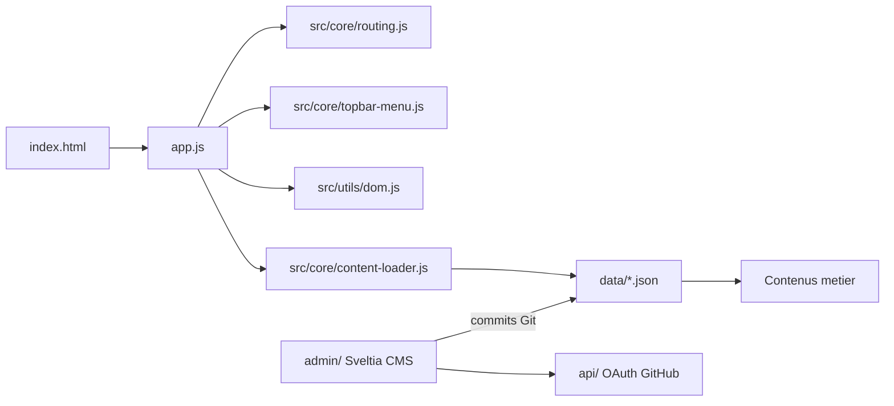

<p align="center">
  
</p>

<h1 align="center">ASA Prenois Bourgogne - Site officiel</h1>

<p align="center">
  Site vitrine statique (HTML/CSS/JS) pour l'ASA Prenois Bourgogne.
</p>

<p align="center">
  
  
  
  
</p>

## Navigation rapide
- [Apercu](#apercu)
- [Objectifs](#objectifs)
- [Demarrage local](#demarrage-local)
- [Verification qualite rapide](#verification-qualite-rapide)
- [Deploiement Vercel](#deploiement-vercel)
- [Architecture](#architecture)
- [Structure du projet](#structure-du-projet)
- [Documentation](#documentation)


## Objectifs
- Afficher les parcours `calendrier`, `inscriptions`, `actualites`, `contacts` et `vie-asa`.
- Rester simple a deployer (aucun build obligatoire).
- Garder un code evolutif avec responsabilites claires et architecture modulaire.

## Demarrage local
1. Ouvrir un terminal dans `Site-circuit`.
2. Demarrer un serveur statique:
   - `python -m http.server 5500`
3. Ouvrir `http://localhost:5500`.

## Verification qualite rapide
Executer les controles automatiques avant push:

```powershell
node --check app.js
node --check src/core/routing.js
node tools/check-quality.cjs
```

## Deploiement Vercel
Le projet est un site statique sans build obligatoire. La configuration Vercel est deja versionnee via `vercel.json`.

### Option 1: via dashboard Vercel
1. Importer le repo GitHub dans Vercel.
2. Garder les parametres par defaut (`Framework Preset: Other`, `Build Command` vide, `Output Directory` vide).
3. Lancer le deploy.

### Option 2: via CLI
```powershell
npm i -g vercel
vercel
vercel --prod
```

### Routing
Les URLs applicatives (`/actualites`, `/meetings/...`, etc.) sont redirigees vers `index.html` via `vercel.json`, ce qui evite les 404 lors d'un refresh.

## Administration du contenu (CMS)
Les membres du bureau peuvent modifier textes, meetings, actualites,
images et PDF depuis l'interface `/admin` (Sveltia CMS). Chaque
publication cree un commit sur `main` et redeploye le site
automatiquement. Installation et guide utilisateur:
[CMS-SETUP.md](./docs/CMS-SETUP.md).

## Architecture

```mermaid
flowchart LR
  A[index.html] --> B[app.js]
  B --> C[src/core/routing.js]
  B --> D[src/core/topbar-menu.js]
  B --> E[src/utils/dom.js]
  B --> H[src/core/content-loader.js]
  H --> F[data/*.json]
  F --> G[Contenus metier]
  I[admin/ Sveltia CMS] -->|commits Git| F
  I --> J[api/ OAuth GitHub]
```

Resume:
- `data/*.json` contient uniquement des donnees metier (editees via `/admin`).
- `src/core/*` contient la logique transverse (chargement contenu/routing/navigation).
- `app.js` orchestre les vues et branche les modules.
- `src/utils/*` contient des fonctions reutilisables sans logique metier.
- `admin/` et `api/` portent le CMS et son authentification GitHub.

## Structure du projet
```text
Site-circuit/
  admin/                 # Interface d'administration Sveltia CMS (/admin)
    index.html
    config.yml           # Collections editables (labels en francais)
  api/
    auth.js              # OAuth GitHub - autorisation (fonction Vercel)
    callback.js          # OAuth GitHub - callback + postMessage CMS
  assets/                # Images, PDF, logos, medias
    uploads/             # Medias televerses depuis le CMS
  data/                  # Donnees de contenu editables (JSON)
    meetings.json        # Calendrier des meetings
    actualites.json      # Articles commissaires + pilotes
    profils.json         # Espaces commissaires/pilotes + formulaires
    pages.json           # Textes des pages du site
    contact.json         # Horaires bureau + email
    legal.json           # Mentions legales / confidentialite / cookies
    documents-pilotes.json # Listes de documents par epreuve/meeting
    run-essence.json     # Numeros du journal Run Essence
  docs/                  # Documentation architecture + standards + CMS
  src/
    core/
      content-loader.js  # Chargement fetch() des data/*.json
      routing.js         # Parsing des routes et titre document
      topbar-menu.js     # Navigation topbar / burger mobile
    utils/
      dom.js             # Helpers DOM (escape, byId)
  app.js                 # Orchestrateur principal (render + cycle route)
  index.html             # Shell HTML
  styles.css             # Styles globaux et responsive
  vercel.json            # Rewrites Vercel (routing SPA, hors /admin et /api)
```

## Documentation
- Architecture: [ARCHITECTURE.md](./docs/ARCHITECTURE.md)
- CMS (installation + guide utilisateur): [CMS-SETUP.md](./docs/CMS-SETUP.md)
- Standards de code: [CODING-STANDARDS.md](./docs/CODING-STANDARDS.md)
- Contribution: [CONTRIBUTING.md](./docs/CONTRIBUTING.md)
- Roadmap technique: [REFACTOR-ROADMAP.md](./docs/REFACTOR-ROADMAP.md)
- Checklist release: [RELEASE-CHECKLIST.md](./docs/RELEASE-CHECKLIST.md)
